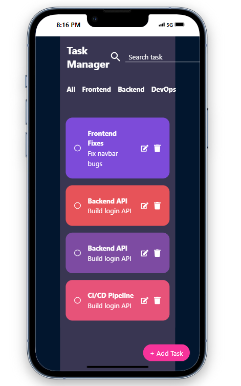
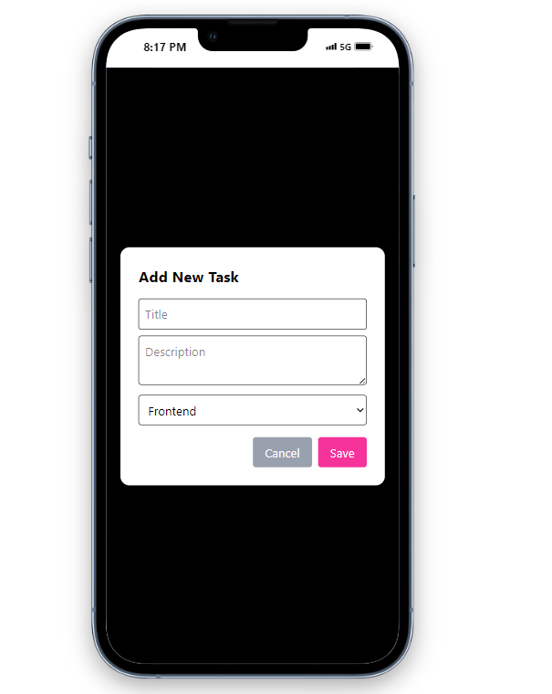
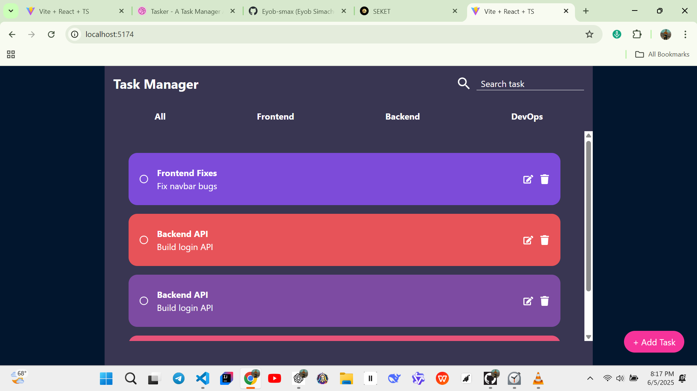
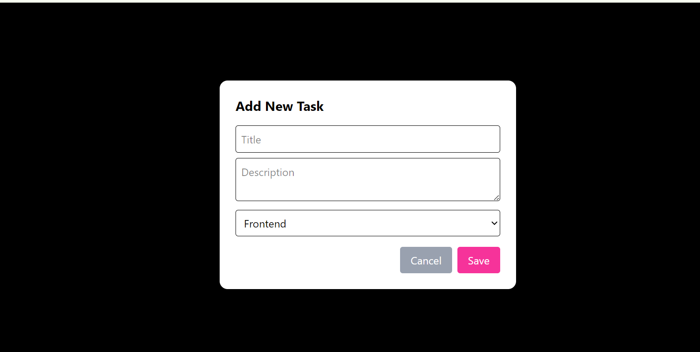

# Fullstack Task Manager App (<b>See the screenshots down below</b>)

👋 Hey! So, funny story — <b>I forgot which role I applied for (frontend or backend)</b>, so I built **both** sides just in case, you know 😅.
This project includes a **Node.js + Express backend** and a **React frontend**, covering all the **required** and even some of the **additional** requirements like this **README.md** and some **validation** for input file and .

---

## 🔧 What I Built

I buid both frontend and backend functionalities for this task manager web app.

## 📸 Screenshot

Here is a preview of the Task Manager App UI:

<p align="center" justify="center">
  
  
  
  
</p>

### ✅ Backend (Node.js + Express)

- RESTful API endpoints to **Create, Read, Update, and Delete** tasks.
- Each task has:
  - `task_id`
  - `title`
  - `description`
  - `status` (e.g., `not_started`, `in_progress`, `completed`)
  - `priority` (e.g., `low`, `medium`, `high`)
  - `due_date`
- Basic validation (e.g. making sure title/description aren't empty).
- Edit task functionality.
- Simple error handling and clear response messages.
- CORS enabled for frontend integration.

### ✅ Frontend (React)

- Task card UI using **Tailwind** CSS..
- Users can:
  - **Add new tasks**
  - **Edit existing tasks**
  - **Delete tasks**
  - **Filter by category**
  - **Search tasks by title or description**
- A modal is used to add and edit tasks.

---

## 📁 Folder Structure

```bash
├── backend/
│   ├── server.js          # Express server
│   └── task.js           # Fake DB (task array)
│
├── frontend/
│   ├── src/
│   │   ├── components/   # Task cards, modal, etc.
│   │   ├── pages/        # Header, Main, Category UI
│   │   └── App.jsx        # Main app logic
```
